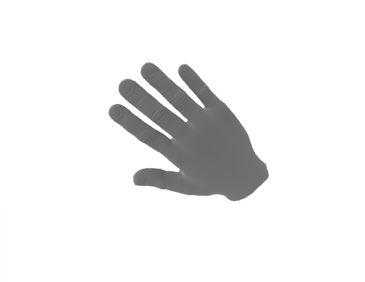
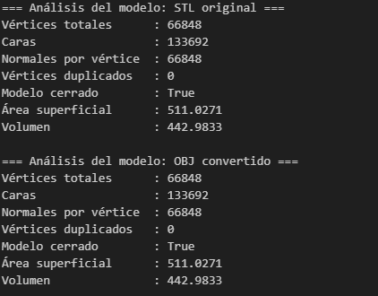
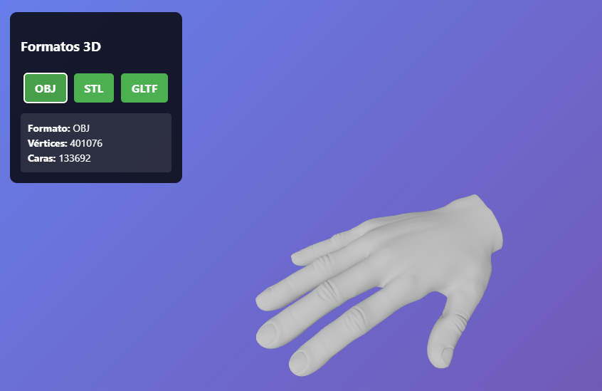
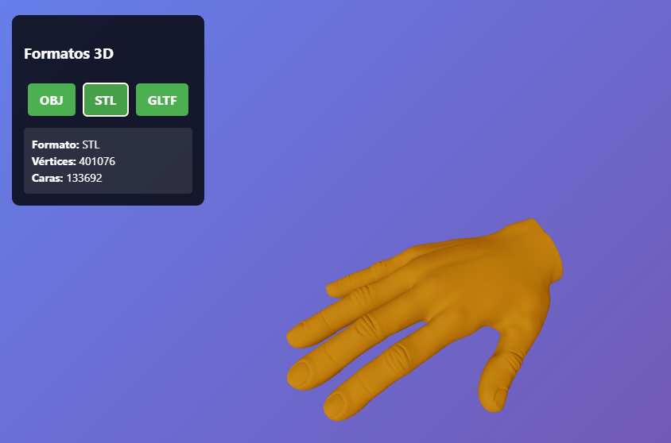

# Taller Conversion Formatos 3D

## Nombre del estudiante

Melissa Forero Narváez

## Fecha de entrega

`2026-02-20`

---


## Descripción breve

Taller sobre conversión y visualización de modelos 3D en formatos OBJ, STL y GLTF, analizando diferencias geométricas y de visualización mediante Python y Three.js.

---

## Implementaciones


### Python

Implementación en Python para conversión, análisis y comparación de modelos 3D usando la librería trimesh:

- Carga de modelos en formatos STL, OBJ y GLTF
- Conversión entre formatos usando `trimesh.export`
- Análisis geométrico
- Comparación de propiedades entre modelos convertidos
- Visualización interactiva de los modelos


### Three.js / React Three Fiber

Comparación de formatos 3D utilizando React Three Fiber, que incluye:

- Implementación de OBJLoader, STLLoader y GLTFLoader para manejar diferentes formatos
- Sistema de botones para alternar entre formatos en tiempo real
- Función automática de conteo de vértices y caras por formato
- Canvas de pantalla completa con iluminación ambiental y direccional
- OrbitControls para exploración 3D completa (zoom, rotación, paneo)
- Display de estadísticas del modelo

---

## Resultados visuales


### Python - Implementación


Animación mostrando el modelo OBJ.


Captura de pantalla del análisis de propiedades y comparación.


### Three.js - Implementación



Vista formato OBJ



Vista formato STL


Vista formato GLTF

---

## Código relevante


### Python:

```python
import trimesh
import numpy as np

def cargar_modelo(ruta):
  return trimesh.load_mesh(ruta)

def analizar_modelo(mesh):
  print(f"Vértices: {len(mesh.vertices)}")
  print(f"Caras: {len(mesh.faces)}")
  unicos = np.unique(np.asarray(mesh.vertices).round(6), axis=0)
  print(f"Duplicados: {len(mesh.vertices) - len(unicos)}")
  print(f"Área: {mesh.area:.2f}")
  print(f"Volumen: {mesh.volume:.2f}")

mesh_stl = cargar_modelo('model.stl')
mesh_stl.export('model.obj')
mesh_obj = cargar_modelo('model.obj')

print("STL:")
analizar_modelo(mesh_stl)
print("OBJ:")
analizar_modelo(mesh_obj)
```


### Three.js:

```javascript
import { Canvas } from '@react-three/fiber'
import { OrbitControls } from '@react-three/drei'
import { useState } from 'react'
import Model from './Model'

export default function App() {
  const [format, setFormat] = useState('obj')
  const [modelInfo, setModelInfo] = useState({ vertices: 0, faces: 0 })

  return (
    <Canvas camera={{ position: [0, 0, 5], fov: 75 }}>
      <ambientLight intensity={0.6} />
      <directionalLight position={[5, 5, 5]} />
      <Model format={format} onModelLoad={setModelInfo} />
      <OrbitControls />
    </Canvas>
  )
}


const countVerticesAndFaces = (object) => {
  let vertices = 0, faces = 0
  object.traverse((child) => {
    if (child.geometry) {
      vertices += child.geometry.attributes.position?.count || 0
      faces += child.geometry.index ? 
        child.geometry.index.count / 3 : 
        child.geometry.attributes.position?.count / 3 || 0
    }
  })
  return { vertices, faces: Math.floor(faces) }
}
```

---


## Prompts utilizados

```
- ¿Cómo convierto STL a OBJ y GLTF automáticamente?

- ¿Cómo comparar propiedades geométricas entre modelos?

- ¿Por qué el modelo desaparece al alternar formatos?

- ¿Cómo mostrar estadísticas del modelo en pantalla?
```

---


## Aprendizajes y dificultades

**Aprendizajes:** Se comprendieron las diferencias clave entre formatos 3D, su conversión y análisis en Python y Three.js.

**Dificultades:** En Python, comparar propiedades entre formatos y calcular volumen en mallas abiertas. En Three.js, problemas de visualización y escalado al alternar modelos.

**Mejoras futuras:** Agregar comparación visual simultánea, análisis automático de diferencias y mejorar la experiencia de usuario en la visualización web.

---

## Contribuciones grupales (si aplica)

Taller realizado de forma individual.

---

## Estructura del proyecto


```
semana_01_2_conversion_formatos_3d/
├── python/              
│   ├── main.ipynb       # Notebook de conversión, análisis y visualización
│   └── models/          # Modelos STL, OBJ, GLTF generados y convertidos
├── threejs/             # Aplicación React Three Fiber
│   ├── src/
│   │   ├── App.jsx      # Componente principal
│   │   ├── Model.jsx    # Cargador de modelos 3D
│   │   ├── main.jsx     # Punto de entrada
│   │   └── index.css   
│   ├── public/
│   │   ├── model.obj    # Modelo en formato OBJ
│   │   ├── model.stl    # Modelo en formato STL
│   │   └── model.gltf   # Modelo en formato GLTF
│   └── package.json     
├── media/               # Imágenes, videos, GIFs
└── README.md            
```

---

## Referencias

- Documentación oficial de React Three Fiber: https://docs.pmnd.rs/react-three-fiber/
- Three.js Official Documentation: https://threejs.org/docs/
- React Three Drei Components: https://github.com/pmndrs/drei
- OBJ File Format Specification: https://en.wikipedia.org/wiki/Wavefront_.obj_file
- STL File Format Documentation: https://en.wikipedia.org/wiki/STL_(file_format)
- GLTF 2.0 Specification: https://github.com/KhronosGroup/glTF
- React Three Fiber Performance Tips: https://docs.pmnd.rs/react-three-fiber/advanced/pitfalls

---
