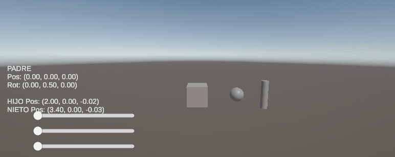
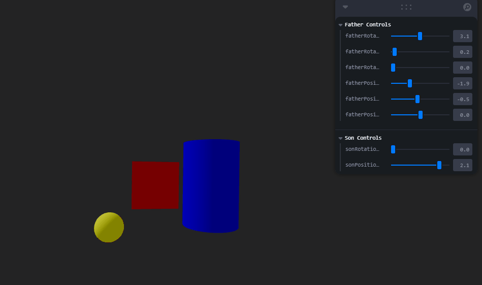

# Jerarquías y Transformaciones: El Árbol del Movimiento

## Nombre del estudiante

Melissa Forero Narváez

## Fecha de entrega

`2026-02-20`

---

## Descripción breve

Aplicar estructuras jerárquicas y árboles de transformación para organizar escenas y simular movimiento relativo entre objetos. Se busca comprender cómo las transformaciones afectan a los nodos hijos en una estructura padre-hijo y cómo visualizar estos efectos en tiempo real.

---

## Implementaciones

### Unity

Se implementó una escena 3D en Unity con tres objetos anidados jerárquicamente: un Cubo (Padre), una Esfera (Hijo) y una Cápsula (Nieto). Se desarrolló un script en C# (`ControladorPadre.cs`) que permite controlar las transformaciones del nodo Padre mediante sliders en la UI para mover en los ejes X, Y y Z, y las teclas Q/E para rotar. La interfaz muestra en tiempo real los valores de posición y rotación del Padre, así como las posiciones mundiales del Hijo y el Nieto, demostrando visualmente cómo los objetos hijos heredan y acumulan las transformaciones del objeto padre a través de la jerarquía.

### Three.js / React Three Fiber

Se implementó una estructura jerárquica de tres niveles utilizando React Three Fiber con controles interactivos en tiempo real mediante Leva GUI.

**Estructura jerárquica implementada:**
- **Padre (Nivel 1)**: Cilindro azul central que actúa como nodo raíz de la jerarquía
- **Hijo (Nivel 2)**: Cubo rojo posicionado relativamente al padre
- **Nieto (Nivel 3)**: Esfera amarilla adjunta al hijo

**Componentes desarrollados:**
- `HierarchicalScene`: Componente principal que maneja la estructura jerárquica y los controles
- Sistema de grupos anidados usando `<group>` de React Three Fiber
- Integración de Leva para controles GUI en tiempo real

**Funcionalidad lograda:**
- Transformaciones jerárquicas donde cada nivel hereda las transformaciones de sus padres
- Controles interactivos para posición y rotación del padre (X, Y, Z)
- Controles independientes para el hijo (posición X, rotación Y)
- El nieto hereda automáticamente todas las transformaciones sin controles propios
- Visualización en tiempo real de cómo las transformaciones se propagan a través de la jerarquía
- Iluminación adecuada y controles de cámara orbital para inspección 360°

---

## Resultados visuales

### Unity - Implementación



 Escena 3D con tres objetos anidados jerárquicamente: un Cubo (Padre), una Esfera (Hijo) y una Cápsula (Nieto). Mediante una interfaz con sliders se controla la posición del nodo Padre en los ejes X, Y y Z, mientras que la rotación se maneja con las teclas Q y E. En la interfaz se muestran en tiempo real los valores de posición y rotación del Padre, así como las posiciones mundiales del Hijo y el Nieto, evidenciando cómo los objetos hijos heredan y acumulan las transformaciones del objeto padre en la jerarquía.

### Three.js - Implementación



Estructura jerárquica de tres niveles mostrando cómo las transformaciones del padre (cilindro azul) afectan al hijo (cubo rojo) y al nieto (esfera amarilla). Los controles interactivos de Leva permiten manipular las transformaciones en tiempo real.

---

## Código relevante

### Unity (C#):

```csharp
using UnityEngine;
using UnityEngine.UI;
using TMPro;
using UnityEngine.InputSystem;

public class ControladorPadre : MonoBehaviour
{
    public Transform padre;
    
    public Slider sliderX;
    public Slider sliderY;
    public Slider sliderZ;
    
    public TMP_Text textoInfo;
    
    void Update()
    {
        // Controlar posición del padre con sliders
        padre.position = new Vector3(sliderX.value, sliderY.value, sliderZ.value);
        
        // Controlar rotación con teclas Q y E
        if (Keyboard.current.qKey.isPressed)
            padre.Rotate(0, -50 * Time.deltaTime, 0);
        if (Keyboard.current.eKey.isPressed)
            padre.Rotate(0, 50 * Time.deltaTime, 0);
        
        // Obtener referencias a hijo y nieto
        Transform hijo = padre.GetChild(0);
        Transform nieto = hijo.GetChild(0);
        
        // Mostrar información en tiempo real
        textoInfo.text =
            $"PADRE\n" +
            $"Pos: {padre.position}\n" +
            $"Rot: {padre.eulerAngles}\n\n" +
            $"HIJO Pos: {hijo.position}\n" +
            $"NIETO Pos: {nieto.position}";
    }
}
```

### Three.js:

```javascript
// Estructura jerárquica principal
function HierarchicalScene() {
  // Controles del padre (Nivel 1)
  const { 
    fatherRotationX, fatherRotationY, fatherRotationZ,
    fatherPositionX, fatherPositionY, fatherPositionZ
  } = useControls('Father Controls', {
    fatherRotationX: { value: 0, min: 0, max: Math.PI * 2, step: 0.1 },
    fatherRotationY: { value: 0, min: 0, max: Math.PI * 2, step: 0.1 },
    fatherRotationZ: { value: 0, min: 0, max: Math.PI * 2, step: 0.1 },
    fatherPositionX: { value: 0, min: -5, max: 5, step: 0.1 },
    fatherPositionY: { value: 0, min: -5, max: 5, step: 0.1 },
    fatherPositionZ: { value: 0, min: -5, max: 5, step: 0.1 }
  })

  // Controles del hijo (Nivel 2)
  const { sonRotationY, sonPositionX } = useControls('Son Controls', {
    sonRotationY: { value: 0, min: 0, max: Math.PI * 2, step: 0.1 },
    sonPositionX: { value: 2, min: -3, max: 3, step: 0.1 }
  })

  return (
    // Padre - Nivel 1
    <group 
      position={[fatherPositionX, fatherPositionY, fatherPositionZ]}
      rotation={[fatherRotationX, fatherRotationY, fatherRotationZ]}
    >
      <mesh>
        <cylinderGeometry args={[1, 1, 3]} />
        <meshStandardMaterial color="blue" />
      </mesh>

      {/* Hijo - Nivel 2 */}
      <group position={[sonPositionX, 0, 0]} rotation={[0, sonRotationY, 0]}>
        <mesh>
          <boxGeometry args={[1.5, 1.5, 1.5]} />
          <meshStandardMaterial color="red" />
        </mesh>

        {/* Nieto - Nivel 3 */}
        <mesh position={[1.5, 1.5, 0]}>
          <sphereGeometry args={[0.5]} />
          <meshStandardMaterial color="yellow" />
        </mesh>
      </group>
    </group>
  )
}
```

---

## Prompts utilizados

```
"¿Cómo crear una jerarquía padre-hijo-nieto en Unity y hacer que los hijos hereden transformaciones del padre?"

"¿Cómo controlar la posición de un objeto mediante sliders de UI en Unity con C#?"

"¿Cómo mostrar en tiempo real los valores de posición y rotación de múltiples objetos en una interfaz TextMeshPro?"

```

---

## Aprendizajes y dificultades

Este taller me permitió profundizar en conceptos fundamentales de computación gráfica y desarrollo de interfaces interactivas. La implementación en dos plataformas distintas (Unity y Three.js) proporcionó una perspectiva amplia sobre cómo diferentes engines manejan las transformaciones jerárquicas, desde los sistemas de coordenadas hasta la propagación de matrices de transformación a través de nodos padre-hijo.

### Aprendizajes

El concepto de transformaciones jerárquicas se aclaró significativamente al implementarlo prácticamente. Comprendí cómo las matrices de transformación se multiplican en cascada: cuando un objeto padre se mueve o rota, todos sus hijos heredan automáticamente esas transformaciones, pero manteniendo sus transformaciones locales relativas al padre. En Unity, esto se maneja a través del sistema de Transform components y la jerarquía del GameObject, mientras que en Three.js/React Three Fiber se logra mediante grupos anidados (`<group>`). También reforcé conceptos de desarrollo de interfaces de usuario interactivas, tanto con el sistema UI de Unity (Sliders, TextMeshPro) como con Leva para controles en tiempo real en React. La implementación me ayudó a entender mejor la diferencia entre coordenadas locales y mundiales, y cómo visualizar estos cambios en tiempo real para una mejor comprensión del usuario.

### Dificultades

La parte más desafiante fue sincronizar correctamente las transformaciones entre los diferentes niveles jerárquicos, especialmente al mostrar las posiciones mundiales en la interfaz de Unity. Inicialmente, los valores mostrados no correspondían con las posiciones reales de los objetos en el espacio 3D debido a que estaba accediendo a las coordenadas locales en lugar de las mundiales. Lo resolví utilizando `transform.position` en lugar de `transform.localPosition` para obtener las coordenadas correctas del espacio mundial. En Three.js, el mayor reto fue configurar correctamente los controles de Leva para que fueran intuitivos y proporcionar retroalimentación visual clara sobre qué transformaciones afectan a qué objetos. También tuve dificultades iniciales para entender cómo React Three Fiber maneja el render loop y las actualizaciones de estado, lo cual resolví revisando la documentación oficial y ejemplos de la comunidad.

### Mejoras futuras

Para futuros proyectos, implementaría animaciones automáticas que demuestren las transformaciones jerárquicas sin intervención del usuario, como órbitas planetarias o cadenas cinemáticas. También sería valioso agregar más niveles jerárquicos (bisnietos, tataranietos) para mostrar cómo las transformaciones se propagan a través de estructuras más complejas. En cuanto a la interfaz, incluiría visualizadores de ejes de coordenadas locales para cada objeto, líneas que conecten los objetos padre-hijo, y una vista de matriz de transformación en tiempo real. Para la implementación web, consideraría agregar animaciones con bibliotecas como Framer Motion o React Spring para hacer las transiciones más fluidas y atractivas visualmente.

---

## Contribuciones grupales (si aplica)

Taller realizado de forma individual.

---

## Estructura del proyecto

```
semana_01_3_jerarquias_transformaciones/
├── unity/                              # Proyecto Unity con jerarquías 3D
│   └── JerarquiaTransformaciones/
│       ├── Assets/
│       │   ├── controlPadre.cs         # Script principal de control
│       │   ├── Scenes/                 # Escenas del proyecto
│       │   └── Settings/               # Configuraciones del proyecto
│       ├── ProjectSettings/            # Configuraciones de Unity
│       └── UserSettings/               # Configuraciones de usuario
├── threejs/                            # Implementación React Three Fiber
│   ├── src/
│   │   ├── App.jsx                     # Componente principal
│   │   ├── main.jsx                    # Punto de entrada
│   │   ├── components/                 # Componentes React
│   │   └── assets/                     # Recursos del proyecto
│   ├── package.json                    # Dependencias del proyecto
│   ├── vite.config.js                  # Configuración de Vite
│   └── index.html                      # Página principal
├── media/                              # Recursos multimedia
│   ├── unity1.gif                      # Demo animado de Unity
│   └── threejs1.gif                    # Demo animado de Three.js
└── README.md                           # Documentación del proyecto
```

---

## Referencias

Lista las fuentes, tutoriales, documentación o papers consultados durante el desarrollo:

- Documentación oficial de Unity - Transform Component: https://docs.unity3d.com/ScriptReference/Transform.html
- Unity Manual - GameObject Hierarchy: https://docs.unity3d.com/Manual/Hierarchy.html
- React Three Fiber Documentation: https://docs.pmnd.rs/react-three-fiber/
- Three.js Official Documentation - Object3D: https://threejs.org/docs/#api/en/core/Object3D
- Leva Controls Documentation: https://github.com/pmndrs/leva
- Microsoft Learn - C# Programming Guide: https://learn.microsoft.com/en-us/dotnet/csharp/
- React Three Fiber Examples: https://docs.pmnd.rs/react-three-fiber/getting-started/examples
- Unity UI System Documentation: https://docs.unity3d.com/Packages/com.unity.ugui@1.0/manual/index.html
- Three.js Fundamentals - Scene Graph: https://threejs.org/manual/#en/fundamentals/scenegraph

---
