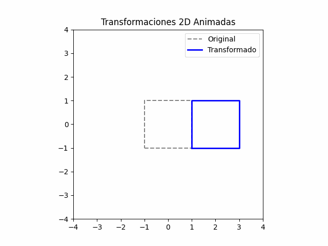
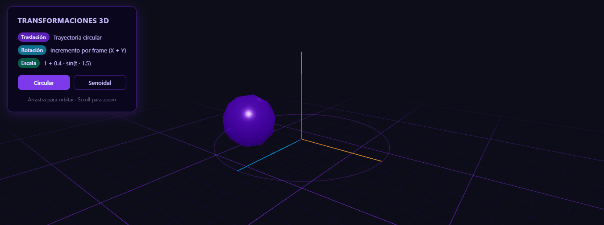
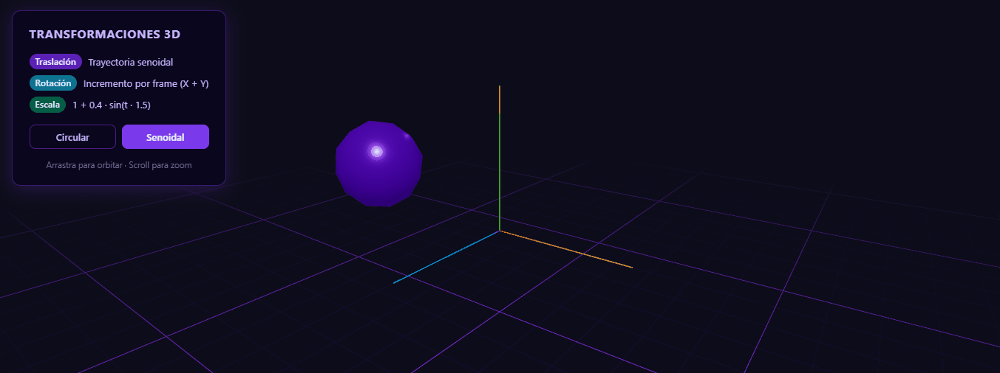
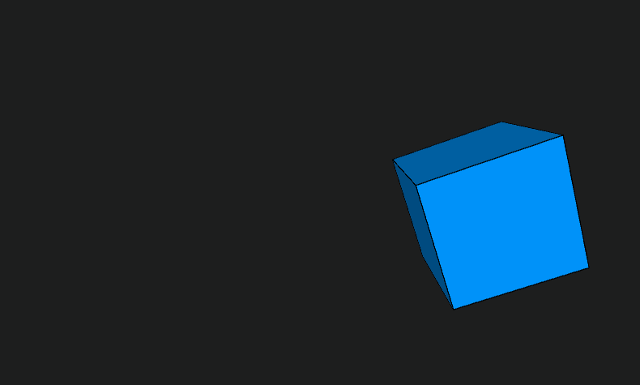

# Transformaciones Básicas en Computación Visual

## Nombre del estudiante

Melissa Forero Narváez

## Fecha de entrega

`2026-02-20`

---

## Descripción breve

Este taller explora las tres transformaciones geométricas fundamentales —**traslación**, **rotación** y **escala**— aplicadas a objetos en 2D y 3D desde tres entornos distintos: Python, React Three Fiber y Processing.

En Python se trabajaron las transformaciones mediante **coordenadas homogéneas** y álgebra matricial con NumPy, generando una animación 2D exportada como GIF. En React Three Fiber se construyó una escena 3D interactiva donde un icosaedro es animado en tiempo real usando el hook `useFrame`, con trayectoria seleccionable (circular o senoidal), rotación incremental por frame y escala variable con `Math.sin`. En Processing se implementó el mismo concepto en 3D nativo, usando el renderer `P3D`, funciones de transformación del sistema de coordenadas y `pushMatrix`/`popMatrix` para aislar la transformación del objeto.

Los tres entornos demuestran que las mismas ideas matemáticas (matrices de transformación, composición de operaciones, parámetros temporales) se expresan con sintaxis y paradigmas completamente diferentes.

---

## Implementaciones

### Python

Se utilizó **NumPy** para construir las matrices de transformación homogéneas 3×3 correspondientes a traslación, rotación y escala en 2D. Un cuadrado definido como cinco puntos en coordenadas homogénicas es transformado en cada frame aplicando la composición `T @ R @ S`. Se generaron 60 frames con **Matplotlib** y se exportaron como GIF con **imageio**.

**Bibliotecas:** `numpy`, `matplotlib`, `imageio`

### Three.js / React Three Fiber

Se creó una escena con **React Three Fiber** (Vite + React) con los siguientes componentes:

- `AnimatedObject` — icosaedro (`IcosahedronGeometry`) animado por `useFrame`:
  - **Traslación circular:** `position.x = cos(t)·r`, `position.z = sin(t)·r`
  - **Traslación senoidal:** avanza en X linealmente, oscila en Y con `sin(t·2)`
  - **Rotación:** `rotation.x += 0.01`, `rotation.y += 0.02` por frame
  - **Escala:** `s = 1 + 0.4·sin(t·1.5)` aplicada uniformemente
- `OrbitRing` — anillo visual que muestra la trayectoria circular
- `Scene` — luces, `Grid`, `axesHelper` y `OrbitControls` (bonus)
- Panel de UI con botones para cambiar entre trayectoria circular y senoidal

**Bibliotecas:** `@react-three/fiber`, `@react-three/drei`, `three`

### Processing

Se implementó en **Processing 4** con renderer `P3D`. El sketch aplica sobre un cubo (`box(120)`):

- **Traslación senoidal en X:** `translate(200·sin(t), 0, 0)`
- **Rotación en X e Y:** `rotateX(t)`, `rotateY(t·1.2)`
- **Escala cíclica:** `scale(1 + 0.5·sin(t·2))`

Se usó `pushMatrix()`/`popMatrix()` para aislar la transformación del cubo del sistema de coordenadas global centrado en pantalla.

---

## Resultados visuales

### Python — Transformaciones 2D animadas



Animación de 60 frames donde un cuadrado azul recorre una trayectoria circular, rota y escala suavemente respecto a su versión original, todo aplicado mediante composición de matrices homogéneas.

### Three.js — Trayectoria circular



Icosaedro púrpura orbitando alrededor del origen con trayectoria circular mientras rota sobre sus propios ejes y pulsa suavemente en escala. Se aprecia el anillo guía y la grilla de referencia.

### Three.js — Trayectoria senoidal



El mismo objeto recorre el eje X de forma lineal mientras oscila verticalmente en una trayectoria senoidal, manteniendo la rotación y el pulso de escala.

### Processing — Cubo 3D animado



Cubo azul en 3D que se traslada sinusoidalmente sobre X, rota simultáneamente en X e Y y escala de forma cíclica, renderizado con iluminación básica de Processing.

---

## Código relevante

### Python — Matrices de transformación homogéneas

```python
def translation(tx, ty):
    return np.array([[1, 0, tx],
                     [0, 1, ty],
                     [0, 0,  1]])

def rotation(theta):
    return np.array([[ np.cos(theta), -np.sin(theta), 0],
                     [ np.sin(theta),  np.cos(theta), 0],
                     [0, 0, 1]])

def scale(sx, sy):
    return np.array([[sx,  0, 0],
                     [ 0, sy, 0],
                     [ 0,  0, 1]])

# Composición y aplicación
transform = T @ R @ S
transformed_square = transform @ square
```

### Three.js — Hook `useFrame` con las tres transformaciones

```jsx
useFrame(({ clock }) => {
  const t = clock.elapsedTime

  // Traslación circular
  meshRef.current.position.x = Math.cos(t) * 3
  meshRef.current.position.z = Math.sin(t) * 3

  // Rotación incremental por frame
  meshRef.current.rotation.x += 0.01
  meshRef.current.rotation.y += 0.02

  // Escala con función temporal
  const s = 1 + 0.4 * Math.sin(t * 1.5)
  meshRef.current.scale.set(s, s, s)
})
```

### Processing — Transformaciones compuestas con pushMatrix

```java
float t = frameCount * 0.02;
translate(width/2, height/2, 0);

pushMatrix();
  float x = 200 * sin(t);
  translate(x, 0, 0);
  rotateX(t);
  rotateY(t * 1.2);
  float s = 1 + 0.5 * sin(t * 2);
  scale(s);
  fill(0, 150, 255);
  box(120);
popMatrix();
```

---

## Prompts utilizados

```
"Como implementar transformaciones 2D con coordenadas homogéneas en NumPy
 y genera una animación GIF con matplotlib e imageio"

"Explicame como crear un componente React Three Fiber con useFrame:
 traslación circular, rotación por frame y escala senoidal"

"Como realizar un sketch de Processing en 3D que aplique traslación, rotación
 y escala cíclica a un cubo usando pushMatrix/popMatrix"
```

---

## Aprendizajes y dificultades

### Aprendizajes

El taller consolidó la comprensión de las transformaciones geométricas como operaciones matriciales. En Python quedó muy claro cómo la composición `T @ R @ S` encadena las transformaciones en el orden correcto y por qué las coordenadas homogéneas son necesarias para incluir la traslación en una multiplicación matricial. En Three.js, trabajar con `useFrame` y el objeto `clock` reforzó el concepto de animación basada en tiempo continuo en lugar de frames discretos, lo que produce movimiento independiente de la tasa de refresco. En Processing, `pushMatrix`/`popMatrix` ilustró perfectamente el concepto de pila de transformaciones del sistema de coordenadas.

### Dificultades

La sincronización entre los tres entornos para que las transformaciones se vieran equivalentes requirió ajustar manualmente las amplitudes y frecuencias (radio de órbita, velocidad angular, factor de escala). En React Three Fiber, el orden de operaciones internas de Three.js (TRS: translation, rotation, scale) difiere del orden de multiplicación matricial explícito de Python, lo que generó confusión inicial al intentar replicar el comportamiento exacto. Se resolvió entendiendo que en R3F las propiedades `position`, `rotation` y `scale` del mesh son independientes y Three.js las compone internamente.

### Mejoras futuras

- Agregar una cuarta transformación: **cizallamiento (shear)** en Python.
- En Three.js, usar `Quaternion` en lugar de ángulos de Euler para evitar el bloqueo de cardán (_gimbal lock_).
- En Processing, implementar jerarquías de objetos (padre-hijo) para ver cómo las transformaciones se heredan en cadena.

---

## Contribuciones grupales

Taller realizado de forma individual.

---

## Estructura del proyecto

```
semana_01_4_transformaciones/
├── python/
│   └── main.ipynb       # Transformaciones 2D con NumPy + animación GIF
├── threejs/             # App React Three Fiber (Vite)
│   └── src/
│       ├── App.jsx      # Escena 3D animada con useFrame
│       └── App.css      # Estilos UI panel + canvas
├── processing/
│   └── sketch/
│       └── sketch.pde   # Cubo 3D animado en P3D
├── media/               # GIFs de resultados
│   ├── python1.gif
│   ├── threejs1.gif
│   ├── threejs2.gif
│   └── processing1.gif
└── README.md
```

---

## Referencias

- Documentación oficial de React Three Fiber: https://docs.pmnd.rs/react-three-fiber/
- Documentación de `@react-three/drei`: https://drei.docs.pmnd.rs/
- Three.js docs — Object3D transformations: https://threejs.org/docs/#api/en/core/Object3D
- Processing Reference — pushMatrix/popMatrix: https://processing.org/reference/pushMatrix_.html
- Shirley & Marschner, *Fundamentals of Computer Graphics*, Cap. 6 — Transformation Matrices

---
